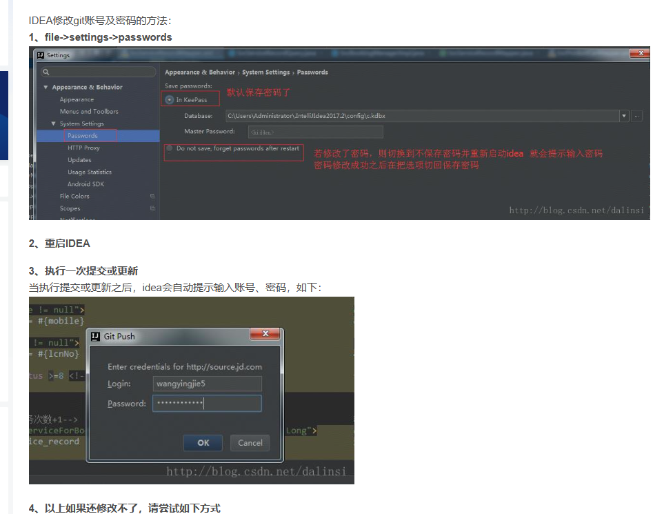

## Git 报错记录
##### git push错误:RPC failed; HTTP 401 curl 22 The requested URL returned error: 401 The remote end hung up

原因：
这是因为本地保存了错误的账号密码
解决：
清除本地保存的账号密码信息，那么再次提交代码是就会重新让你输入账号密码了。

https://blog.csdn.net/dalinsi/article/details/77989840

## java报错记录
##### Invalid bound statement (not found): fun.fan.xc.hc.mapper.UserMapper.selectById

原因：
BaseMapper.selectById()方法用于根据主键id查询单个对象。没有将实体类中对应属性用@TableId注释，并映射数据库主键。

改正：
将实体类中对应属性用@TableId注释，并映射数据库主键。

##### `BaseMapper.selectById()可能的出问题的地方有：`
- 可能是你的数据库中的字段名id 和实体类中的参数id不一致，需要加上 @TableId(value = “数据库中的id”, type = IdType.ASSIGN_ID)注解
- 如果加了id映射后也没有数据，那么可能就是你的其他字段，比如逻辑删除isDeleted 在建表的时候没有设置成非空默认值为0，加上@TableLogic注解（逻辑删除的注解）后，也会出现数据查询不到的结果。

##### mybatis-BindingException: Parameter 'userId' not found. Available parameters

- 关键报错:

BindingException
Parameter ‘userId’ not found. 

Available parameters are [arg1, arg0, param1, param2]

可能的原因：
多参数查询时，参数绑定失败，缺少@param 参数

https://blog.csdn.net/C_Wangjq/article/details/105458420

##### com.fasterxml.jackson.databind.exc.InvalidDefinitionException

原因：
com.fasterxml.jackson.databind.ObjectMapper.readValue(String content, Class<T> valueType)方法，传入的class对象没有无参构造器，具体原因是在该对象上同时使用了@Data和@AllArgsConstructor注解，@AllArgsConstructor阻止了@Data生成（无参）构造器，从而该对象只有一个全参构造器，没有无参构造器，导致反序列化失败。应当注意显式的构造器和@NoArgsConstructor, @RequiredArgsConstructor, @AllArgsConstructor都会抑制@Data生成构造器。

解决方法：
显式添加无参构造器或使用@NoArgsConstructor