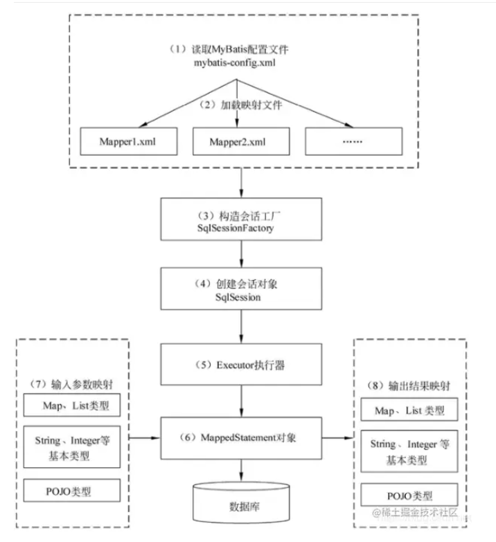

## MyBatis
半自动的ORM框架
- 封装sql
- 调用JDBC操作数据库
- 把数据库返回的表结果封装成Java类
### MyBatis工作原理
 

### 实体类构建案例
```java
package com.kaven.mybatisplus.entity;

import com.baomidou.mybatisplus.annotation.TableField;
import com.baomidou.mybatisplus.annotation.TableId;
import com.baomidou.mybatisplus.annotation.TableName;
import lombok.Data;

@TableName("user")
@Data
public class User {

    @TableId
    private String id;

    @TableField("username")
    private String username;

    @TableField("password")
    private String password;

    @TableField("age")
    private Integer age;

    /**
     * 使用 @TableField(exist = false) ，表示该字段在数据库中不存在 ，所以不会插入数据库中
     * 使用 transient 、 static 修饰属性也不会插入数据库中
     */
    @TableField(exist = false)
    private String phone;
}

```
//to do: 什么是sql注入

### MyBatis-Plus教程
- 汇总：https://kaven.blog.csdn.net/article/details/108982474
- 使用案例：https://blog.csdn.net/lydms/article/details/119060130
- 条件构造器：https://blog.csdn.net/Huang_ZX_259/article/details/122524602
- 官方文档
- MyBatis架构与工作原理：https://juejin.cn/post/6993253212853633055#heading-12
- BaseMapper: https://juejin.cn/post/7002423698565103653#heading-1

### @Param注解
- @Param的作用就是给参数命名
- 为sql语句中参数赋值而服务
- SQL语句通过@Param注解中的别名把对象中的属性取出来
- 使用了@Param注解来声明参数的时候，SQL语句取值使用#{}，${}取值都可以。不使用@Param注解声明参数的时候，必须使用的是#{}来取参数。
-  不使用@Param注解时，参数只能有一个，并且是Javabean。

eg.
```java
    @Select("SELECT * from Table where id = #{id}")
    Enchashment selectUserById(User user);
 
```

#### 分页：关键字limit实现分页；Interceptor Plugin实现分页;PageHelper实现分页。
#### pageHelper的使用及其原理解析

### Mysql的JSON字段的读取和转换
https://blog.csdn.net/xiaoyao2246/article/details/114749661

### mybatisPlus之自动填充工具MetaObjectHandler使用

https://blog.csdn.net/csdn_20150804/article/details/121584855

