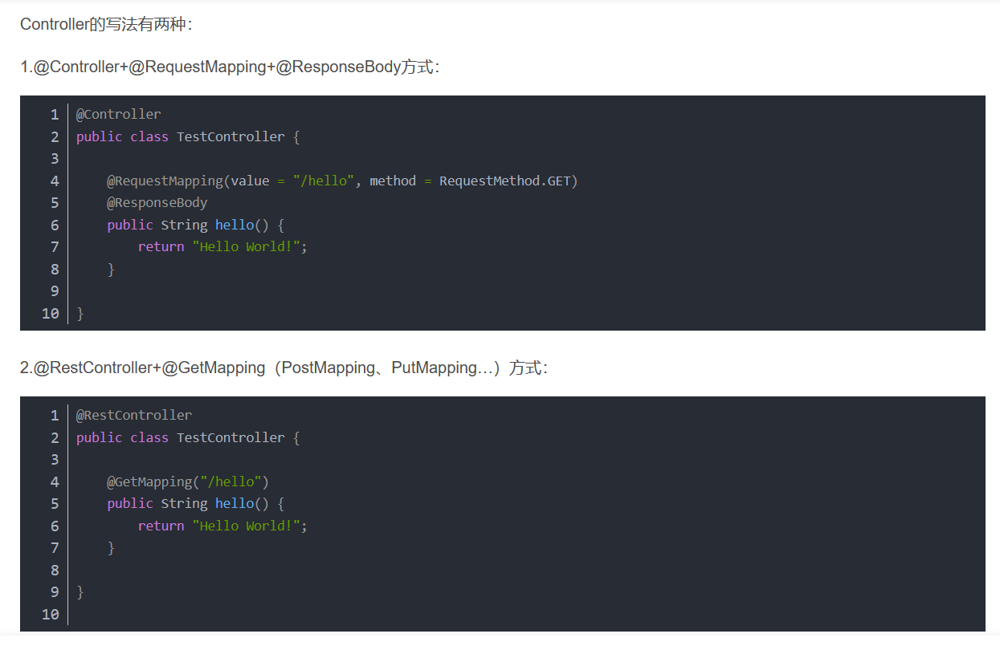

#springboot
Spring Boot是一个基于Spring的套件，它帮我们预组装了Spring的一系列组件，以便以尽可能少的代码和配置来开发基于Spring的Java应用程序。

**微服务**
微服务是一种架构风格，可以理解成小型服务，这些服务通过HTTP的方式进行互通。

- 传统的应用成为“单体应用”，核心分为业务逻辑、适配器以及API或通过UI访问的WEB界面。业务逻辑定义业务流程、业务规则以及领域实体。适配器包括数据库访问组件、消息组件以及访问接口等，所有的这些东西都集成在一起，看着很强大，其实很乱。
- 微服务架构将单体应用分解为一组服务。功能总量不变，但应用程序已被分解为可管理的模块或服务。这些服务定义了明确的RPC或消息驱动的API边界。
- 微服务架构强化了应用模块化的水平微服务开发的速度要快很多，更容易理解和维护。
  
**classpath**
https://www.jianshu.com/p/3f61ac9b0ec2
classpath 是包含 Java 类和资源文件的路径集合。

在 Spring Boot 中，可以通过在application.properties 或 application.yml文件中配置 spring.resources.static-locations 属性来指定应用程序的静态资源路径，这些路径也会被包含在 classpath 中。
  
**@Bean**是向SpringBoot容器中添加组件，并交由SpringBoot管理！
**@RestController 和 @RequestMapping 注解**

- @RestController 被称为 stereotype 注解。 它为阅读代码的人和Spring提供了提示，说明这个类扮演了一个特定的角色。
-  @RequestMapping 注解提供了 “routing” （路由）信息。 它告诉Spring，任何带有 / 路径的HTTP请求都应该被映射到 home 方法。
-  @RestController 注解告诉Spring将返回的结果字符串直接响应给客户端。

**@SpringBootApplication 注解**
这个注解被称为元注解.它结合了 @SpringBootConfiguration、@EnableAutoConfiguration 和 @ComponentScan。其中，@EnableAutoConfiguration 告诉Spring Boot根据你添加的jar依赖项 "猜测" 你想如何配置Spring。

**@RequestBody**是一个Spring框架中的注解，它用于在处理HTTP请求时将请求体中的数据绑定到一个Java对象上,@RequestBody注解只能用于POST、PUT、PATCH等具有请求体的HTTP方法，不能用于GET、DELETE等没有请求体的HTTP方法。


## Controller(业务控制层)

## service(层业务层/服务层)
Service层的结构:**接口+实现**。
首先定义interface,然后写实现类Impl。 实现类前@Service注解，代表它是一个Service。
## Dao 层 (数据库持久化层)
- 传统 web 开发中，我们首先需要定义 Dao 接口，然后定义 DaoIImpl 类实现接口。
- 代理开发方式, Mybatis 提供了一种代理开发的方式:项目开发中 Mybatis 实现 Dao 层的主流。
- 代理开发方式只需要程序员编写Mapper 接口（相当于Dao 接口），然后由 Mybatis 框架根据接口定义创建接口的动态代理对象，代理对象的方法体同上边Dao接口实现类方法。 代理开发方式使用的是动态代理的 JDK 代码实现的。

Mapper 接口需要遵循以下规范：
- 映射文件中的mapper标签的namespace属性与 mapper 接口的全限定名相同
- 映射文件中的每条映射语句中id的属性值与 mapper 接口中方法名相同
- 映射文件中的每条映射语句的parameterType属性与 mapper 接口中方法的形参相同
- 映射文件中的每条映射语句的resultType属性与 mapper 接口中方法的返回值类型相同

Servlet:https://blog.csdn.net/qq_35415600/article/details/76100568


## 工具类
- **Apache POI**
  Apache POI是一个开源的Java库，用于读写Microsoft Office格式的文件，包括Excel、Word和PowerPoint等文件格式。
  
  JavaDoc是用于记录Java源代码API的标准化文档，它描述了类、方法、变量和参数等的使用说明，帮助开发人员更好地理解和使用代码。
  http://poi.apache.org/apidocs/dev/index.html是Apache POI项目的JavaDoc文档网址。
- **MultipartFile**
MultipartFile是SpringMVC提供简化上传操作的工具类。
```java
package org.springframework.web.multipart;

import java.io.File;
import java.io.IOException;
import java.io.InputStream;
import java.nio.file.Files;
import java.nio.file.Path;
import org.springframework.core.io.InputStreamSource;
import org.springframework.core.io.Resource;
import org.springframework.lang.Nullable;
import org.springframework.util.FileCopyUtils;

public interface MultipartFile extends InputStreamSource {
    //getName() 返回参数的名称
    String getName();
    //获取源文件的昵称
    @Nullable
    String getOriginalFilename();
    //getContentType() 返回文件的内容类型
    @Nullable
    String getContentType();
    //isEmpty() 判断是否为空，或者上传的文件是否有内容
    boolean isEmpty();
    //getSize() 返回文件大小 以字节为单位
    long getSize();
    //getBytes() 将文件内容转化成一个byte[] 返回
    byte[] getBytes() throws IOException;
    //getInputStream() 返回InputStream读取文件的内容
    InputStream getInputStream() throws IOException;

    default Resource getResource() {
        return new MultipartFileResource(this);
    }
    //transferTo是复制file文件到指定位置(比如D盘下的某个位置),不然程序执行完,文件就会消失,程序运行时,临时存储在temp这个文件夹中
    void transferTo(File var1) throws IOException, IllegalStateException;

    default void transferTo(Path dest) throws IOException, IllegalStateException {
        FileCopyUtils.copy(this.getInputStream(), Files.newOutputStream(dest));
    }
}

```
- **XSSFWorkbook**
https://blog.csdn.net/heshengfu1211/article/details/103451380

```
    <select id="searchCompositeEquipmentBoxMonitorByPage" parameterType="java.util.Map" resultMap="BaseResultMap">
        composite_equipment_box_monitor m left join composite_equipment_box b on m.composite_equipment_box_id = b.composite_equipment_box_id left join road_section s on b.road_section_id = s.objectid
        from
        <where>
            <if test="deleteFlag != null">
                and m.delete_flag = #{deleteFlag,jdbcType=INTEGER}
            </if>
        </where>

    </select>
```
**springboot跨域及三种解决方式**
https://cloud.tencent.com/developer/article/1924258

