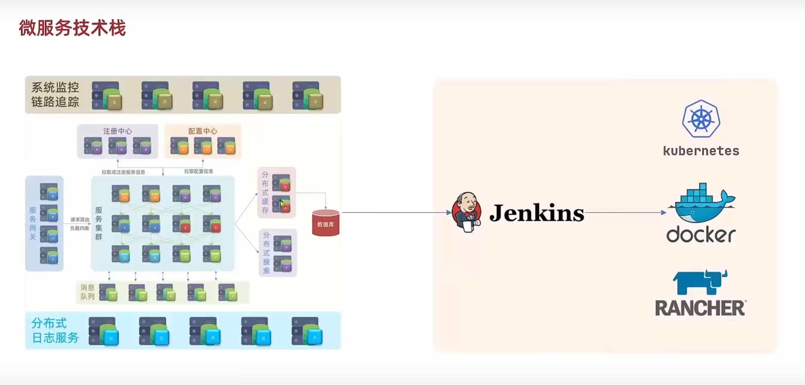
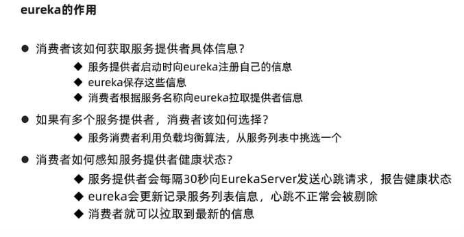
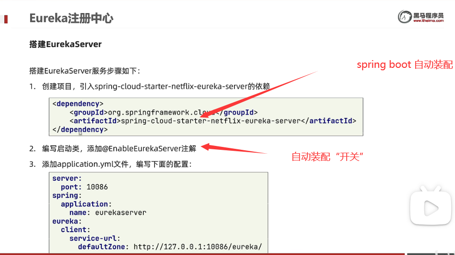
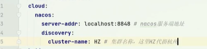
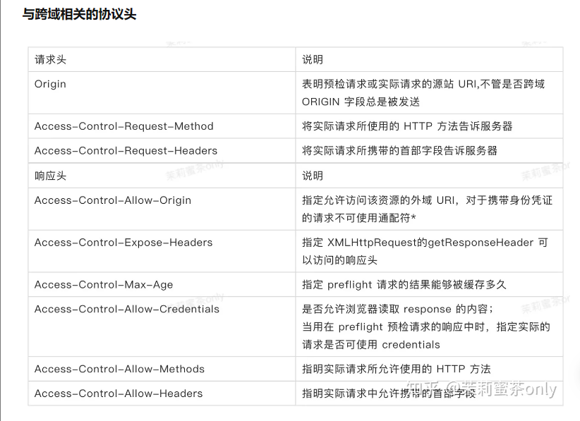

#spring cloud
分布式架构：把服务拆分
spring cloud:解决服务拆分时的治理问题
####微服务技术：
- 微服务，又称微服务  架构，是一种架构风格，它将应用程序构建为以业务领域为模型的小型自治服务集合。
- 微服务是系统架构上的一种设计风格，
它的主旨是将一根原本独立的系统拆分多个小型服务，这些小型服务都在各自独立的进程中运行，
服务之间通过基于HTTP的RESTful API进行通信协作。
被拆分的每一个小型服务都围绕着系统中某一项或一些耦合度较高的业务功能进行构建，
并且每个服务都维护这自身的数据存储、业务并发、自动化测试案例以及独立部署机制。
由于有了轻量级的通信协作基础，所有这些微服务可以使用不同的语言来编写。
- 从技术维度来说：微服务化的核心就是将传统的一站式应用，根据业务拆分成一个一个的服务，彻底地去耦合,每一个微服务提供单个业务功能的服务，一个服务做一件事，从技术角度看就是一种小而独立的处理过程，类似进程概念，能够自行单独启动或销毁，拥有自己独立的数据库。
  

####微服务技术栈

 
- 服务开发：Springboot、Spring、SpringMVC
- 服务配置与管理：Netflix公司的Archaius、阿里的Diamond等
- 服务注册与发现：Eureka、Consul、Zookeeper等
- 服务调用：Rest、RPC、gRPC
- 服务熔断器：Hystrix、Envoy等
- 负载均衡：Ribbon、Nginx等
- 服务接口调用(客户端调用服务的简化工具)：Feign等
- 消息队列：Kafka、RabbitMQ、ActiveMQ等
- 服务配置中心管理：SpringCloudConfig、Chef等
- 服务路由（API网关）：Zuul等
- 服务监控：Zabbix、Nagios、Metrics、Spectator等
- 全链路追踪：Zipkin，Brave、Dapper等
- 服务部署：Docker、OpenStack、Kubernetes等
- 数据流操作开发包：SpringCloud Stream（封装与Redis,Rabbit、Kafka等发送接收消息）
- 事件消息总线：Spring Cloud Bus

==微服务技术栈==：微服务治理、异步通信技术、缓存技术、搜索技术和DevOps

###微服务的特点

解耦  – 系统内的服务很大程度上是分离的。因此，整个应用程序可以轻松构建，更改和扩展
组件化  – 微服务被视为可以轻松更换和升级的独立组件
业务能力  – 微服务非常简单，专注于单一功能
自治  – 开发人员和团队可以彼此独立工作，从而提高速度
持续交付  – 通过软件创建，测试和批准的系统自动化，允许频繁发布软件
责任  – 微服务不关注应用程序作为项目。相反，他们将应用程序视为他们负责的产品
分散治理  – 重点是使用正确的工具来做正确的工作。这意味着没有标准化模式或任何技术模式。开发人员可以自由选择最有用的工具来解决他们的问题
敏捷  – 微服务支持敏捷开发。任何新功能都可以快速开发并再次丢弃

###服务拆分
- 不同微服务，不要重复开发相同的业务
- 微服务数据独立，不要访问其他微服务的数据库
- 微服务可以将自己的业务暴露为接口，供其他微服务调用

### restTemplate

- 1、创建RestTemplate并注入Spring容器（通过在RestTemplate类上添加@Component注解或在配置类中使用@Bean注解来完成的）
- 2、使用@Autowired注解将RestTemplate注入到要发送http请求的组件当中
- 3、使用RestTemplate来发送HTTP请求

### Eureka注册中心

eureka-server：也是微服务，会把自己注册到eureka上

eureka-client

 
eg.
```
搭建EurekaServer
将user-service、order-service注册到eureka
在order-service完成服务拉取，通过负载均衡挑选服务，实习远程调用。
```
- 搭建EurekaServer

 

- 负载均衡 ： @LoadBalanced

给RestTemplate的@Bean方法加上@LoadBalanced注解 

### Ribbon
拦截请求，从eureka-server拉取服务,进行负载均衡。
- 默认采用懒加载，
**饥饿加载**
- 配置yml开启

### nacos
- 服务的注册与发现
- 分布式配置

**Spring Cloud Commons**

- nacos服务分级存储模型
同一个机房的多个实例称为集群。一级：服务；二级：集群；三级：实例
服务跨集群调用问题：服务尽可能选择本地集群。
服务集群属性的配置eg：


**Nacos配置管理**
Nacos除了可以做注册中心，同样可以做配置管理来使用。Nacos 一方面可以将配置集中管理，另一方可以在配置变更时，及时通知微服务，实现配置的热更新。
- 统一配置管理。
- 配置热更新：热更新最终的目的，是修改 nacos 中的配置后，微服务中无需重启即可让配置生效。
https://blog.csdn.net/qq_39788123/article/details/123357278#:~:text=%E9%85%8D%E7%BD%AE%E7%83%AD%E6%9B%B4%E6%96%B0%20%E7%83%AD%E6%9B%B4%E6%96%B0%E6%9C%80%E7%BB%88%E7%9A%84%E7%9B%AE%E7%9A%84%EF%BC%8C%E6%98%AF%E4%BF%AE%E6%94%B9%20nacos%20%E4%B8%AD%E7%9A%84%E9%85%8D%E7%BD%AE%E5%90%8E%EF%BC%8C%E5%BE%AE%E6%9C%8D%E5%8A%A1%E4%B8%AD%E6%97%A0%E9%9C%80%E9%87%8D%E5%90%AF%E5%8D%B3%E5%8F%AF%E8%AE%A9%E9%85%8D%E7%BD%AE%E7%94%9F%E6%95%88%EF%BC%8C%E4%B9%9F%E5%B0%B1%E6%98%AF%20%E9%85%8D%E7%BD%AE%E7%83%AD%E6%9B%B4%E6%96%B0%20%E3%80%82%20%E6%9C%89%E4%B8%A4%E7%A7%8D%E6%96%B9%E5%BC%8F%EF%BC%9A%20%E6%96%B9%E5%BC%8F%E4%B8%80%EF%BC%9A,%E5%9C%A8%20%40Value%20%E6%B3%A8%E5%85%A5%E7%9A%84%E5%8F%98%E9%87%8F%E6%89%80%E5%9C%A8%E7%B1%BB%E4%B8%8A%E6%B7%BB%E5%8A%A0%E6%B3%A8%E8%A7%A3%20%40RefreshScope%20%E6%96%B9%E5%BC%8F%E4%BA%8C%EF%BC%9A%20%E7%9B%B4%E6%8E%A5%E7%94%A8%20%40ConfigurationProperties%20%E8%AF%BB%E5%8F%96%E9%85%8D%E7%BD%AE

**bootstrap.yml**引导文件
优先级高于application.yml,项目启动后先打开bootstrap.yml
**@Value注解读取配置**
**@RefreshScope**
@RefreshScope是一个Spring Cloud注解，它用于实现配置的动态刷新。当您使用@RefreshScope注解时，Spring Cloud会自动将标记的bean包装在一个代理对象中，并在接收到/actuator/refresh端点的POST请求时，自动刷新该bean的属性值。这使得您可以在运行时更改应用程序的配置，而无需重启应用程序或重新部署代码。
- 使用@RefreshScope注解非常简单，只需将其添加到需要动态刷新的bean上即可。
- 注意，只有使用@Configuration注解的bean才能使用@RefreshScope注解。
- 如果您使用了@Value注解来注入属性值，请确保将其与@RefreshScope一起使用，以便在刷新配置时更新属性值。

**@ConfigurationProperties**

用于将配置文件中的属性值映射到Java对象的属性上。使用@ConfigurationProperties注解时，Spring Boot会自动读取配置文件中的属性值，并将其映射到被注解的Java对象的属性上.==轻松地将应用程序的配置文件转换为Java对象==
- 为了使用@ConfigurationProperties注解，您需要在应用程序的类路径下拥有一个properties或yml文件，并且该文件中包含要映射到Java对象上的属性。
**多环境配置共享**

### Feign
**声明式**
- 开关:@EnableFeignClients
**java接口**
### Gateway
- 身份认证和权限校验
- 服务路由、负载均衡
- 请求限流

**GatewayFilter**路由过滤器
- 全局过滤器（逻辑可以自定义，自己写代码实现）

实现GlobalFilter接口
- 默认过滤器
- 局部过滤器

跨域：
- 域名不同
- 域名相同，端口不同

跨域问题：浏览器禁止请求的发起者与服务端发送跨域ajax请求，请求被浏览器拦截的问题

解决方案：CORS
CORS 跨域的原理实际上是浏览器与服务器通过一些 HTTP 协议头来做一些约定和限制。


### Docker
Docker将应用的Libs、Deps、配置与应用一起打包，并将每一个应用放到一个隔离容器去运行，避免相互干扰；将用户程序和所需要调用的系统函数库一起打包，Docker运行在不同操作系统时，直接基于打包的库函数来借助于Linux系统内核运行。
docker面试题库：https://blog.csdn.net/qq_43286578/article/details/105160725
- **什么是docker**
Docker是一个容器化平台，它以容器的形式将你的应用程序及所有的依赖项打包在一起，以确保你的应用程序在任何环境中无缝运行。
- **Docker与虚拟机**
Docker 和虚拟机有什么不同？
Docker 是轻量级的沙盒，在其中运行的只是应用，虚拟机里面还有额外的系统。虚拟机的执行性能不如docker，启动速度慢，体积大。
- 镜像
Docker镜像是Docker容器的源代码，Docker镜像用于创建容器，使用Build命令创建镜像。镜像创建后都是只读的。
- 容器
可以将容器视为 Docker 镜像的运行时实例。镜像中的应用程序运行后形成的进程就是容器，Docker会给容器做隔离。
docker容器有四种状态：四种状态：运行、已停止、重新启动、已退出。
- docker架构

docker是CS架构程序
- 服务端：Docker守护进程，处理Docker指令，管理镜像、容器
- 客户端：发送命令。

一个完整的Docker由以下组成：
DockerClient 客户端
Docker Daemon 守护进程
Docker Image 镜像
DockerContainer 容器

- Docker操作镜像
**docker --help**
- docker run :创建容器
- docker pause:暂停，挂起容器进程
- docker stop:停止,杀死容器进程，仅保留容器文件系统
- docker start
- docker exec 进入容器执行命令
- docker logs 查看所有运行的容器状态
- docker ps 查看所有运行的容器及状态
创建容器：
- 去docker hub查看容器运行命令

**数据卷**
数据卷是一个虚拟目录，指向宿主机的某个目录。/var/lib/docker/volumes
```
docker run -it -v 主机目录:容器目录

```
**DockerCompose**
Docker Compose 是一个用来定义和运行复杂应用的Docker工具。一个使用Docker容器的应用，通常由多个容器组成。使用Docker Compose不再需要使用shell脚本来启动容器。Compose 通过一个配置文件来管理多个Docker容器。简单理解：Docker Compose 是docker的管理工具。

### MQ
- 同步：同步调用即调用方得等待这个调用返回结果才能继续往后执行。
优点：时效性较强，可以立即得到结果。
问题：
- 耦合度高
- 性能和吞吐能力下降
- 有额外的资源消耗（不是很理解）
- 级联失败
eg.微服务间基于Feign的调用就属于同步调用
同步调用的问题：
- 异步：异步调用，
eg.事件驱动模式：

优势：
- 服务间耦合度低
- 性能提高，吞吐量提高
- 故障隔离，服务间没有强依赖，不担心级联失败问题
- 流量削峰：高并发流量到来后通过通过Broker进行缓存，微服务基于自己的能力从Broker获取事件，起到保护微服务的作用。高并发被砍平。
  
缺点：
- 依赖于Broker的可靠性、安全性、吞吐能力
- 架构复杂了，业务没有明显的流程线，不好追踪管理
缺点：
1，系统可用性降低:
2，系统复杂性增加:
要多考虑很多方面的问题：
一致性问题
如何保证消息不被重复消费
如何保证保证消息可靠传输

**MQ的选择**
- 如果我们业务只是收发消息这种单一类型的需求，而且可以允许小部分数据丢失的可能性，但是又要求极高的吞吐量和高性能的话，就直接选Kafka就行了，就好比我们公司想要收集和传输用户行为日志以及其他相关日志的处理，就选用的Kafka中间件。
- 如果自己所处公司业务比较平稳，未来几年内不会出现飞速发展，而且没有什么改源码的特殊需求的话，在面对选择MQ的时候就可以选用RabbitMQ。毕竟如今这样的中小公司也就是这么干的。
- 如果自己所处公司发展迅猛，一年经常搞一些特别大的促销秒杀活动，公司技术栈主要是Java语言的话，就直接一步到位选择RocketMQ，这样会省很多事情。


==MQ(消息队列)==
