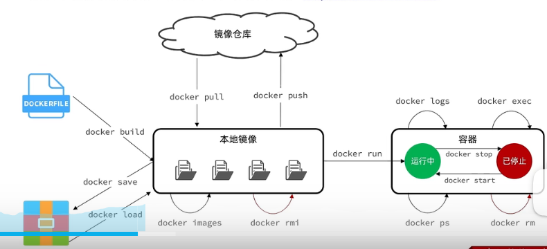
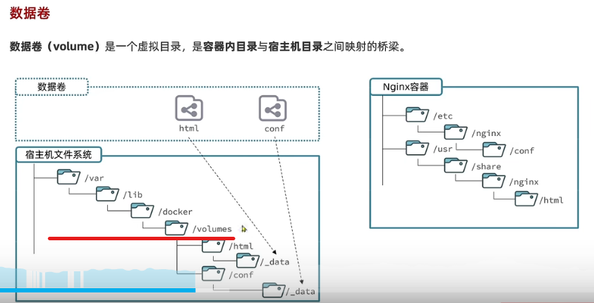

##容器、容器云、云容器三者有什么区别？
https://www.zhihu.com/question/471715726


容器技术是云原生时代一切技术的基石。
容器 = 最精简的操作系统+执行环境+你的应用。
容器≠docker

容器云：在讲容器云这个概念的时候，它更多强调的是以容器为基本单位这件事情本身。基于容器封装的软件运行时环境，提供他的平台就是容器云平台。

K8S等容器云的时候,非常难以避免的一个问题就是我们需要花入大量的时间和精力来自己搭建K8S，并且还要在使用的过程中处理各种繁杂的运维问题：包括但不限于网络，带宽，存储，硬件等问题。
因此即想要使用容器的解耦和便利，又想同时得到容器云的运维，就需要使用到华为的云容器技术了。云容器其实指的就是以华为云容器引擎CCE 和云容器实例CCI 为代表的建立在云上的容器环境。把运维工作全部交给云服务商来负责，由更加专业的人来做专业的事情，而普通的业务逻辑则由自己完成，分工明确，工作高效。
### Docker中容器和镜像的关系
docker的整个生命周期有三部分组成：镜像（image）+容器（container）+仓库（repository）。

                          docker 容器=镜像+可读层
容器是由镜像实例化而来。
==容器是基于镜像创建的，即容器中的进程依赖于镜像中的文件。==
docker 的镜像概念类似虚拟机的镜像。是一个只读的模板，一个独立的文件系统，包括运行容器所需的数据，可以用来创建新的容器。docker利用容器来运行应用：docker容器是由docker镜像创建的运行实例。
from CSDN:https://blog.csdn.net/qq_40722827/article/details/102827125

## 启动 Docker

```bash
$ sudo systemctl enable docker
$ sudo systemctl start docker
```

## 建立 docker 用户组

默认情况下，`docker` 命令会使用 [Unix socket](https://en.wikipedia.org/wiki/Unix_domain_socket) 与 Docker 引擎通讯。而只有 `root` 用户和 `docker` 组的用户才可以访问 Docker 引擎的 Unix socket。出于安全考虑，一般 Linux 系统上不会直接使用 `root` 用户。因此，更好地做法是将需要使用 `docker` 的用户加入 `docker` 用户组。

建立 `docker` 组：

```bash
$ sudo groupadd docker
```

将当前用户加入 `docker` 组：

```bash
$ sudo usermod -aG docker $USER
```
再使用命令
```bash
$ newgrp docker
```
最好加个重启的命令
```bash
sudo systemctl restart docker
```


####使用过的命令：
```bash
docker ps -a//查看所有容器
```
#报错记录
dockerbuild的时候==The command ‘/bin/sh -c yum -y install vim‘ returned a non-zero code: 1==。
build的时候 yum默认使用的是宿主机上的，因为centos的版本不一样，导致的yum失败
来源：
https://blog.csdn.net/Onetiger_/article/details/123879235

wget 的方式下载 JDK：
https://blog.csdn.net/weixin_43563446/article/details/123232901

### docker官方文档 https://docs.docker.com/

#### docker run命令的常见参数
- -d :让容器后台运行
- --name :给容器命名
- -e ：环境变量
- -p : 宿主机端口映射到容器内端口  -p 宿主机端口：容器内端口

##### 镜像名称结构：Repository:TAG   镜像名：版本号

#### docker命令



##### docker vi！/.bashrc 可以给docker命令设置别名。

#### docker数据卷

##### 数据卷在宿主机下 `/var/lib/docker/volumes`/XXX/_data目录进行映射
- 执行docker run 时，使用 **-v 本地目录：容器内目录**，则可以完成本地目录挂载。本地目录一定要以/ 或者 ./开头。


#### 数据卷必须在创建容器时创建，如果创建容器时，挂载了数据卷但数据卷不存在，则会自动创建数据卷。
